# Auth Api Service

This is an authentication api service that can serve as a 3rd party authentication service for other services.

## Documentation

Endpoint docs can be found at /api/docs or [Documentation](https://documenter.getpostman.com/view/15040280/VUjMnkSx)

## Features

1. Login  - POST /api/v1/auth/login
2. Signup - POST /api/v1/auth/signup **(can only create a user role)**
3. Logout - GET /api/v1/auth/logout
4. Verify Account - GET /api/v1/auth/verify_account/:token
5. Forgot Password - POST /api/v1/auth/password_reset
6. Password Reset - POST /api/v1/auth/password_reset/:token
7. List Users - GET /api/v1/auth/users **(requires token) (admin and manager only)**
8. Get User - GET /api/v1/auth/user/:id **(requires token) (all roles)**
9. Update User - PUT /api/v1/auth/user/:id **(requires token) (all roles)**
10. Delete User - DELETE /api/v1/auth/user/:id **(requires token) (admin only)**
11. Change User Role - PUT /api/v1/auth/user/:id/role **(requires token) (admin only)**

### USer roles

1. admin
2. manager
3. staff
4. user

## Setup

1. clone the repository using `git clone <repository_url>`
2. cd into the cloned directory
3. install the dependencies using `npm install`
4. create a .env file and using the .env.sample file as a template, fill in the details
5. run the dev server using `npm run dev`

### Screenshots

1. Login Image  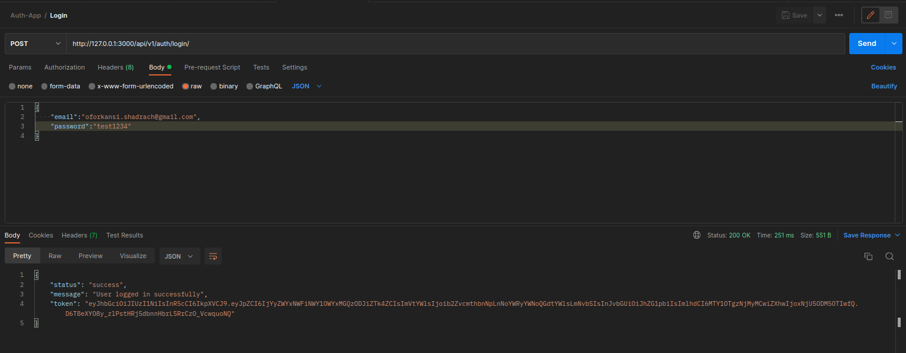
2. Signup Image 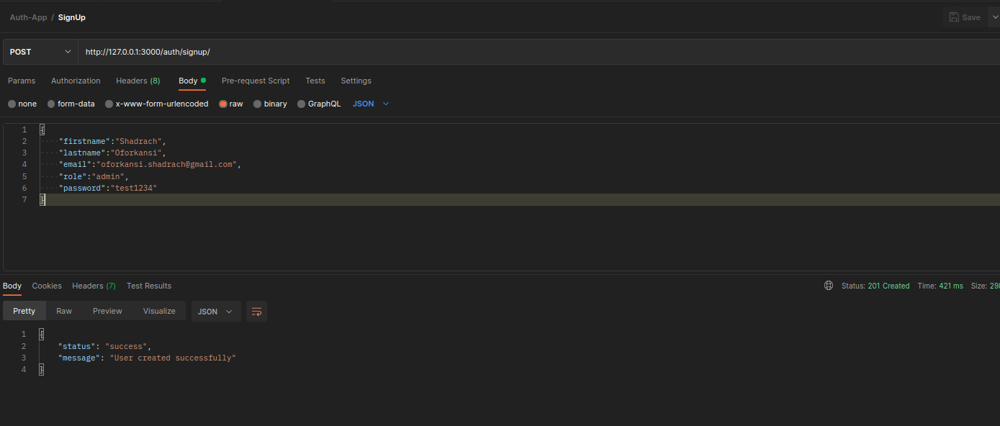
3. Logout Image 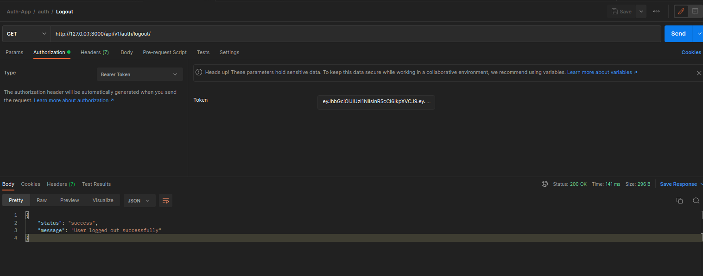
4. Verify Account Mail Image 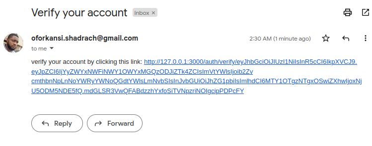
5. Verify Account Image 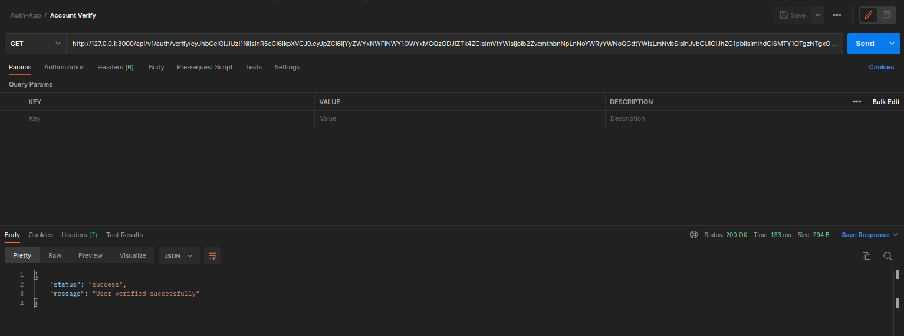
6. Forgot Password Image 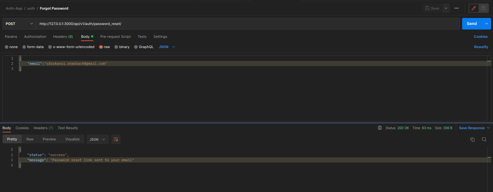
7. Reset Password Mail 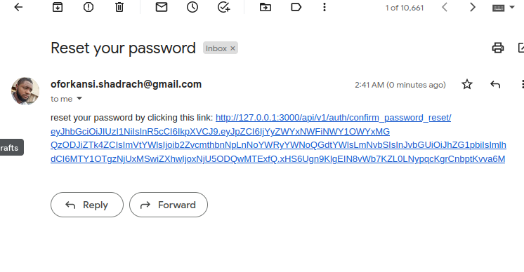
8. Reset Password Image 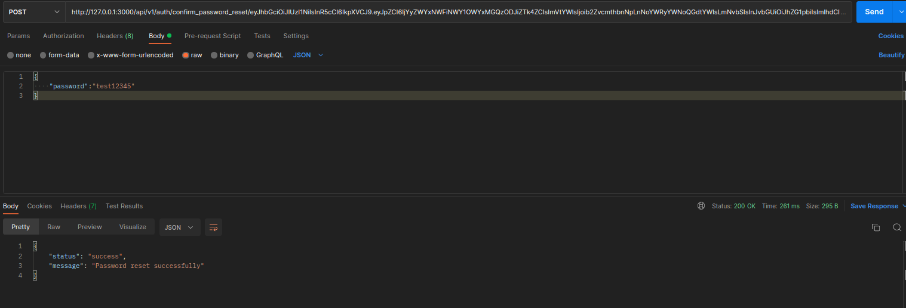
9. List Users Image 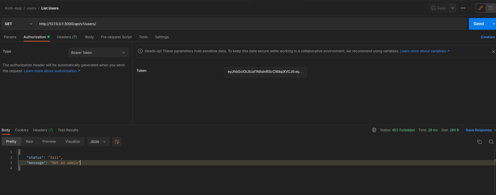
10. Delete User Image Fail 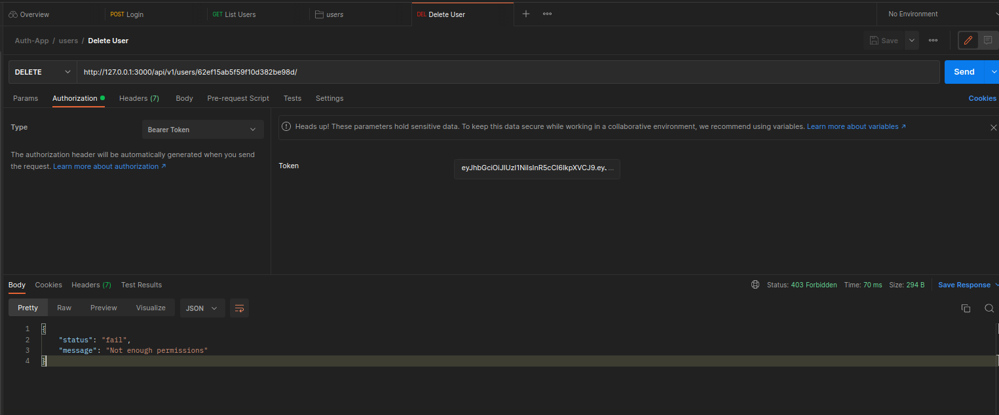
11. Delete User Image Success 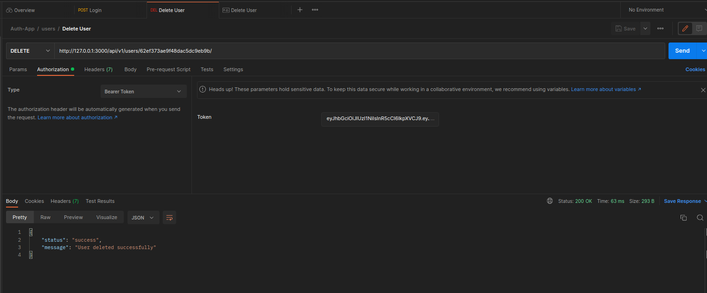
